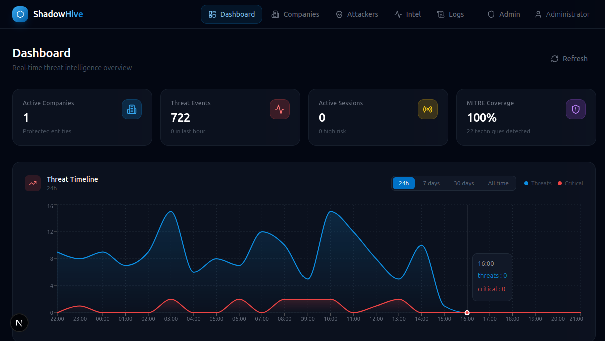
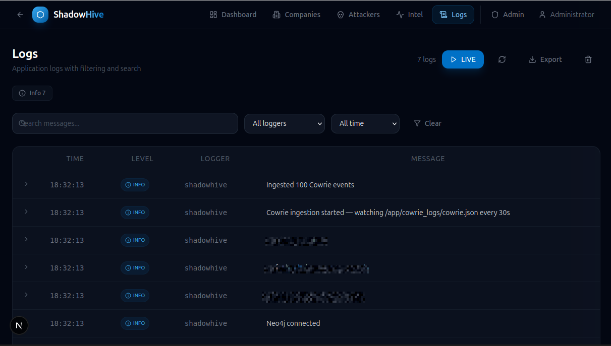

# ShadowHive

**Autonomous Deception and Adversary Intelligence**  
AI-Powered Adaptive Honeypot Personalities Platform

ShadowHive generates realistic, evolving company environments — complete with employees, emails, documents, network infrastructure, security configurations, and attack artifacts — to create believable deception environments that attract and study attackers. Generated companies are **persisted to PostgreSQL** and can be **deployed as live honeypots**: Cowrie SSH honeypot gets employee credentials + realistic filesystem, and a dedicated HTTP portal serves the company website with intentionally vulnerable endpoints. It combines deception technology, generative AI, and threat intelligence into a single platform.

---

## Architecture

```
┌─────────────────────────────────────────────────────────────────────────────────────┐
│                              SHADOWHIVE PLATFORM                                     │
│                                                                                     │
│  ┌─────────────────────────────────────────────────────────────────────────────┐   │
│  │                          FRONTEND (Next.js)                                  │   │
│  │  ┌──────────────┐  ┌──────────────┐  ┌──────────────────────────┐           │   │
│  │  │ Company View  │  │ Honeypot View│  │  Intelligence View       │           │   │
│  │  │ - Generate    │  │ - Sessions   │  │  - MITRE ATT&CK Map      │           │   │
│  │  │ - Manage      │  │ - Commands   │  │  - Threat Analysis       │           │   │
│  │  │ - Deploy      │  │ - Real-time  │  │  - Attack Timelines      │           │   │
│  │  │ - Templates   │  │              │  │                          │           │   │
│  │  └──────┬───────┘  └──────┬───────┘  └──────────┬───────────────┘           │   │
│  └─────────┼─────────────────┼─────────────────────┼──────────────────────────┘   │
└────────────┼─────────────────┼─────────────────────┼──────────────────────────────┘
             │                 │                     │
             │           ┌─────┴─────────────────────┴──────────────┐
             │           │           REST API (FastAPI)              │
             │           │  POST /api/companies/generate             │
             │           │  POST /api/deploy/{company_id}            │
             │           │  GET  /api/companies                      │
             │           │  GET  /api/companies/{id}                 │
             │           │  GET  /api/stats /threats /sess           │
             │           └─────┬──────────────────┬──────────────────┘
             │                 │                  │
             ▼                 ▼                  ▼
   ┌──────────────────┐  ┌──────────────┐  ┌──────────────────────────┐
   │  AI PROVIDER      │  │  SERVICES    │  │  INGESTION ENGINE        │
   │  ABSTRACTION      │  │              │  │                          │
   │  ┌───────────┐   │  │ Task Manager │  │  CowrieClient (API poll) │
   │  │ Ollama    │   │  │ (async queue)│  │  HoneypotFileWatcher     │
   │  │ (Free)    │   │  │              │  │  (JSON log poll x5)      │
   │  ├───────────┤   │  │ Company      │  │                          │
   │  │ OpenAI    │   │  │ Persister    │  │  ┌────────────────────┐  │
   │  │ (Paid)    │◄──┼──┤              │  │  │ _parse_honeypot    │  │
   │  ├───────────┤   │  │ Honeypot     │  │  │ _event() nromalizer│  │
   │  │ Anthropic │   │  │ Deployer     │  │  └────────────────────┘  │
   │  │ (Paid)    │   │  │ MITRE Mapper │  │                          │
   │  └───────────┘   │  │ Graph Builder│  │  Log Sources Watched:   │
   │                  │  │ Metrics      │  │  • opencanary.json       │
   │                  │  └──────┬───────┘  │  • portal_honeypot.json  │
   └────────┬─────────┘         │          │  • wordpress.json        │
            │                   │          │  • cowrie2.json          │
            ▼                   ▼          │  • cowrie3.json          │
   ┌─────────────────────────────────────┐ └──────────────────────────┘
   │          COMPANY GENERATOR           │
   │  (9 Phases: Profile → Employees →  │
   │   Emails → Docs → Infrastructure → │
   │   Network Depth → DevOps → Security │
   │   Config → Attack Artifacts)        │
   │  Supports overrides + security      │
   │  posture + weaknesses               │
   └──────────────────┬──────────────────┘
                      │
                      ▼
   ┌──────────────────────────────────────────────────────────────────┐
   │                    PERSISTENCE + DEPLOYMENT                       │
   │                                                                  │
   │  ┌──────────────────────┐      ┌──────────────────────────────┐  │
   │  │   PostgreSQL DB      │      │   Honeypot Data (Volume)     │  │
   │  │                      │      │                              │  │
   │  │  • companies         │      │  • userdb.txt (Cowrie auth)  │  │
   │  │  • employees         │◄─────┤  • contents/ (filesystem)    │  │
   │  │  • emails            │      │  • active_company.json       │  │
   │  │  • documents         │      └──────────┬───────────────────┘  │
   │  │  • servers/networks  │                 │                     │
   │  │  • security configs  │                 ▼                     │
   │  └──────────┬───────────┘      ┌────────────────────────┐      │
   │             │                  │   PORTAL :8001 (:80)   │      │
   │             │                  │  Company Website +     │      │
   │             └─────────────────┤  Vulnerable Endpoints   │      │
   │                                │  + Honeypot Login Pages│      │
   │                                └────────────────────────┘      │
   └──────────────────────────────────────────────────────────────────┘
                      │
                      ▼
   ┌─────────────────────────────────────────────────────────────────────┐
   │                      HONEYPOT FARM                                   │
   │                                                                      │
   │  ┌─────────────┐  ┌─────────────┐  ┌─────────────┐                 │
   │  │  Cowrie :2222  │  Cowrie2 :2223 │  Cowrie3 :2224 │                 │
   │  │  (Main SSH)  │  │  (Extra SSH) │  │  (Extra SSH) │                 │
   │  └──────┬──────┘  └──────┬──────┘  └──────┬──────┘                 │
   │         │                │                │                          │
   │  ┌──────┴──────────────────┴──────────────────┴─────────┐           │
   │  │              OpenCanary (12 protocols)                │           │
   │  │  FTP  Telnet  SMTP  POP3  IMAP  SMB  MySQL  RDP      │           │
   │  │  VNC  HTTP Proxy  SIP  TFTP  Git                     │           │
   │  └──────────────────────┬───────────────────────────────┘           │
   │                         │                                           │
   │  ┌──────────────────────┴───────────────────────────────┐           │
   │  │              Dionaea (Malware Capture)                │           │
   │  │  FTP  SMB  MSSQL  MySQL  SIP  HTTP  TFTP             │           │
   │  └──────────────────────┬───────────────────────────────┘           │
   │                         │                                           │
   │  ┌──────────────────────┴───────────────────────────────┐           │
   │  │  WordPress Honeypot :8081                             │           │
   │  │  • Vulnerable wp-config.php                           │           │
   │  │  • Apache access log watcher                          │           │
   │  └──────────────────────┬───────────────────────────────┘           │
   │                         │                                           │
   │  ┌──────────────────────┴───────────────────────────────┐           │
   │  │  Portal Honeypot Pages (served on :80)               │           │
   │  │  /wp-login.php  /phpmyadmin/  /jenkins/  /gitlab/   │           │
   │  │  /webmail/  /vpn/  /api/v1/keys                     │           │
   │  └──────────────────────────────────────────────────────┘           │
   │                                                                      │
   │  ┌───────────┐  All events → honeypot_logs/ (shared host mount)     │
   │  │ Prometheus │  API polls: opencanary.json, portal_honeypot.json,  │
   │  │ Metrics    │  wordpress.json, cowrie2.json, cowrie3.json         │
   │  └───────────┘  + Cowrie API poll via CowrieClient                  │
   └─────────────────────────────────────────────────────────────────────┘
```

---

## Tech Stack

| Layer | Technology | Cost |
|---|---|---|
| **AI (Default)** | Ollama + Llama 3.2 / 3.1 | Free, self-hosted |
| **AI (Optional)** | OpenAI (GPT-4o) / Anthropic (Claude) | Pay-per-token |
| **Backend** | Python 3.12, FastAPI | Free |
| **Databases** | PostgreSQL, Neo4j (Graph) | Free (Community) |
| **Honeypots** | Cowrie (main + 2 extra), OpenCanary (12 protocols), Dionaea, WordPress honeypot | Free |
| **Portal** | FastAPI + Jinja2 (standalone container, port 80) + honeypot login pages | Free |
| **Frontend** | React, Next.js 15, Tailwind, Recharts | Free |
| **Infrastructure** | Docker Compose | Free |

---

## Company Generation

ShadowHive generates companies in **9 phases** (4 core + 5 optional enrichment). Each phase makes an independent LLM call with progress reported to the frontend:

| Phase | Progress | Description | Opt-in |
|---|---|---|---|---|---|
| Profile | 0% → 10% | Name, description, location, departments | Always |
| Employees | 10% → 35% | Personas per department with realistic titles | Always |
| Emails | 35% → 60% | Internal email threads between employees | Always |
| Documents | 60% → 85% | Reports, memos, specs with realistic content | Always |
| Infrastructure | 85% → 90% | Servers, network devices, subnets, cloud infra | ✓ toggle |
| Network Depth | 90% → 92% | DNS records, load balancers, SSL certs, active alerts | ✓ toggle |
| DevOps Pipeline | 92% → 93% | CI/CD configs, source leaks, container registries, Terraform state | ✓ toggle |
| Security Config | 93% → 95% | Firewall rules, EDR, patch gaps, service accounts, VPN | ✓ toggle |
| Attack Artifacts | 95% → 99% | Honeytokens, config leaks, exposed credentials | ✓ toggle |

Each phase receives context from the previous one (departments inform employees, employees inform emails, etc.), ensuring internal consistency. Enrichment phases are opt-in via an "Infrastructure Enrichment" toggle — they add depth for attackers to explore but increase generation time by 3-6 minutes.

### Advanced Options

Beyond `industry` and `size`, you can provide **optional overrides**:

| Field | Type | Description |
|---|---|---|
| `company_name` | string | Use an exact name instead of AI-generated |
| `description` | text | Background context for the AI to incorporate |
| `location` | string | Set a specific city/region |
| `technologies` | list[str] | Tech stack (Python, AWS, K8s...) — referenced in emails/docs |
| `security_posture` | enum | Controls deliberate weakness generation |
| `enrich` | bool | Enable full enrichment (infrastructure, network depth, CI/CD pipelines, security config, attack artifacts) |

### Security Posture & Deliberate Weaknesses

The `security_posture` field controls what kinds of security weaknesses the AI deliberately generates in emails and documents:

| Posture | Effect |
|---|---|
| `default` | 1 plausible mid-market weakness |
| `mature` | Strong security culture, at most 1 minor issue |
| `startup` | Lean security — 1-2 weaknesses (hardcoded keys, open buckets) |
| `neglected` | Poor security — 2-3 weaknesses (plaintext passwords, default creds, unpatched CVEs) |

These weaknesses make the honey data more enticing to attackers who find exposed credentials or misconfigurations.

### Infrastructure Enrichment

When the `enrich` toggle is enabled, 5 additional phases generate a complete network environment:

**Infrastructure** — Servers with hostnames, IPs, roles, and OS versions; network devices (switches, routers, firewalls); subnets with VLANs; cloud infrastructure (AWS/Azure accounts and resources).

**Network Depth** — DNS records (A/CNAME/MX mapping hostnames to IPs), load balancer/reverse proxy configs (nginx, HAProxy, ALBs with listeners and upstream pools), SSL certificates (issuer, validity, SANs — with expired/self-signed flags for neglected posture), and active intrusion alerts (Snort, Windows Event IDs, pfSense blocks, EDR detections scaled to posture).

**DevOps Pipeline** — CI/CD pipeline configurations (Jenkins, GitHub Actions, GitLab CI) with deliberately exposed secrets or misconfigurations appropriate to the posture; source code leaks (Pastebin, GitHub gists) containing hardcoded credentials; container registries with vulnerability counts (many critical vulns for neglected posture); and Terraform state files exposing cloud infrastructure resources and secrets.

**Security Configuration** — Firewall rules forming a coherent policy; EDR status and coverage; patch gaps with real CVE references; over-privileged service accounts; VPN configuration details. All scaled to the chosen `security_posture`.

**Attack Artifacts** — Honeytokens and deliberately placed findings: config files with embedded credentials, SSH keys, SQL dumps, CI/CD tokens, browser exports. These give an attacker who compromises the network something realistic to pillage. Filenames, paths, and content excerpts reference real employee names and server IPs for consistency.

### Task Lifecycle

Generation is **async** — the POST returns immediately with a `task_id`, and the frontend poll for updates:

| Action | Endpoint | Description |
|---|---|---|
| Start | `POST /api/companies/generate` | Returns `{task_id}` immediately |
| Pause | `POST /.../tasks/{id}/pause` | Freezes generation mid-phase |
| Resume | `POST /.../tasks/{id}/resume` | Continues from where it paused |
| Cancel | `POST /.../tasks/{id}/cancel` | Cancels the asyncio task |
| Delete | `DELETE /.../tasks/{id}` | Removes task from history |
| Poll | `GET /.../tasks/{id}` | Returns status, progress, result |
| List | `GET /.../tasks` | 20 most recent tasks |

### Saved Templates

Profile configurations can be saved and reused:

| Action | Endpoint |
|---|---|
| Save | `POST /api/companies/profiles` |
| List | `GET /api/companies/profiles` |
| Get | `GET /api/companies/profiles/{id}` |
| Delete | `DELETE /api/companies/profiles/{id}` |

### Progress Tracking

```
Frontend polls every 3s        Backend updates on each phase
┌──────────┐   GET /tasks/id   ┌──────────────────────────┐
│  React   │ ◄─────────────── │  FastAPI + TaskManager    │
│  (3s)    │ ────────────────►│  on_progress(pct,msg)     │
│  timer   │   JSON response   │  phases: 7 LLM calls max │
└──────────┘                   └──────────────────────────┘
     │                               │
     ▼                               ▼
Progress bar + message       Real % per completed phase
+ elapsed seconds            + error handling per phase
+ Pause / Resume / Stop      + pause/resume/delete support
+ Timer pauses with task     + enrichment opt-in toggle
```

---

## Threat Intelligence

All dashboard data (stats, threats, sessions) queries **real database data** instead of hardcoded mock values. On startup, if the `attacker_events` table is empty, seed events with full MITRE ATT&CK coverage (all 14 tactics) are loaded automatically.

| Endpoint | Description |
|---|---|
| `GET /api/stats?range=24h\|7d\|30d\|all` | Company/threat/session counts, MITRE coverage, timeline with configurable range |
| `GET /api/threats` | Threat events with severity/tactic filters |
| `GET /api/sessions` | Attacker sessions grouped by IP — includes `commands_executed` and `duration_minutes` computed from raw events |
| `POST /api/events` | Ingest single or batch Cowrie-compatible events (auth optional) |

### Timeline Range Selector

The threat timeline supports four zoom levels via the `?range` query parameter:

| Value | Bucketing | Use Case |
|-------|-----------|----------|
| `24h` | Hourly bars | Last 24 hours — quick pulse check |
| `7d` | Daily bars | Week overview |
| `30d` | Daily bars | Month trends |
| `all` | Weekly (≤180d) or monthly | Full history |

Invalid values return a 422 validation error. Missing values default to `24h`.
When no threats exist in the selected period, the frontend shows an
"empty-state" overlay.

### Session Commands & Duration

The `/api/sessions` endpoint now reports:

- **`commands_executed`** — Number of events with a non-NULL `command` field
  (empty strings are normalized to NULL on storage)
- **`duration_minutes`** — Time span between the first and last event
  `detected_at` timestamps in the session

These values are computed inline during the database query, not stored as
separate columns.

### Event Ingestion

ShadowHive accepts events from any honeypot via `POST /api/events`. The
endpoint accepts both single and batch payloads in Cowrie-compatible JSON
format. Events are stored as `AttackerEvent` rows and instantly reflected
in stats, sessions, and threat views. Ingestion works with or without
authentication. See [USAGE.md](USAGE.md#4-ingesting-events) for examples.

---

## Company Persistence & Deployment

Generated companies can be **persisted to PostgreSQL** and **deployed as live honeypots**.

### Persistence (Phase 1)

When generation completes, the result dict is automatically saved across 18 database tables (employees, emails, documents, servers, network devices, security configs, etc.) via `backend/services/company_persister.py`. Tables are created on first startup via SQLAlchemy ORM auto-migration.

### Honeypot Deployment (Phase 2 — Cowrie Injection)

The **Honeypot Deployer** (`backend/services/honeypot_deployer.py`) takes a persisted company and generates:

| Artifact | Location | Purpose |
|---|---|---|
| `userdb.txt` | `honeypot_data/` | Cowrie auth — employees can SSH in with their creds |
| `contents/` dir | `honeypot_data/` | Realistic filesystem (home dirs, projects, `.ssh`, notes) |
| `active_company.json` | `honeypot_data/` | Metadata for the portal |

Cowrie reads the shared `honeypot_data` volume. If the Docker socket is mounted, the deployer restarts Cowrie automatically.

| Endpoint | Description |
|---|---|
| `POST /api/deploy/{company_id}` | Deploy company to Cowrie honeypot |
| `POST /api/undeploy` | Remove active deployment |
| `GET /api/deploy/status` | Show current deployment status |

### HTTP Portal (Phase 3)

A standalone **FastAPI + Jinja2** application (`portal/`) serves a realistic fake company website on port **80**. It pulls live company data from PostgreSQL — employees, departments, documents, emails — and renders professional pages designed to look credible to attackers.

The portal features a modern responsive design with Google Fonts (Inter), gradient avatar initials for team members, background images from Unsplash, fade-in animations, and social media footer links (LinkedIn, X, GitHub — plain text anchors replacing `href="#"`). Every deployed company gets a unique look with its own branding, job listings, and contact information.

**Public pages:**

| Page | Description |
|---|---|
| `/` | Company landing page — hero with stats, team preview, services, insights (all CSS utility classes, no inline styles) |
| `/about` | Company profile with office photos, department overview |
| `/team` | Employee directory with avatar initials and bios |
| `/careers` | Realistic job listings with salary ranges per department |
| `/blog` | Internal documents as blog-style articles |
| `/contact` | Working contact form (POST handler logs submissions as honeypot data) |
| `/admin` | Admin dashboard with sidebar, metrics, email log, employee directory |

**Intentionally vulnerable / decoy endpoints:**

| Endpoint | Vulnerability |
|---|---|
| `/.env` | Environment secrets with realistic tokens (Sentry DSN, Slack bot tokens, AWS keys) |
| `/.git/config` | Leaks repository metadata with embedded GitHub PAT (`ghp_*`) |
| `/.htaccess` | Apache config with legacy API redirect |
| `/composer.json` | PHP dependency file (Laravel + dev packages) |
| `/sitemap.xml` | XML sitemap listing all site paths |
| `/backup/` | Directory listing of fake database dumps |
| `/robots.txt` | Honeytoken paths (disallows `/admin`, `/backup`) |
| `/api/users` | Unauthenticated user data dump |
| `/api/orders` | Unauthenticated order data dump |
| `/update-profile` | Blind stored XSS via name/email/bio |

The portal also serves **honeypot login pages** that capture credentials to `honeypot_logs/portal_honeypot.json`, which the API automatically ingests:

| Path | Credential Capture |
|---|---|
| `/wp-login.php` | WordPress admin login |
| `/phpmyadmin/` | Database management login |
| `/jenkins/` | CI/CD admin login |
| `/gitlab/` | Git repository login |
| `/webmail/` | Email web client login |
| `/vpn/` | VPN portal login |
| `/api/v1/keys` | API key capture (POST) |

The portal container (`shadowhive-portal`) runs on network `hive-net` and connects to PostgreSQL for live company data. It is automatically deployed when the deploy endpoint is called. The portal uses Jinja2 templates with a `base.html` layout, SVG favicon (linked directly from static, no route), and a responsive CSS framework with animations and mobile breakpoints. All 8 templates were rewritten to use CSS utility classes (zero inline styles except hero background images). A standalone `portal/preview.html` is available for direct browser preview without a server.

The portal is served behind **nginx**, which splits traffic: port 80 serves the public portal, while port 8080 serves the admin dashboard server block. The nginx config is hardened against dotfile access.

The admin login page pre-fills `admin` as the username (no hardcoded "Default credentials" text). The admin dashboard sidebar uses `javascript:void(0)` instead of `href="#"` for placeholder links. A subtle HTML comment hints at "debug endpoints pending cleanup" as a decoy for attackers. Blog article labels display the raw `doc_type` (e.g., "Report", "Plan") without a prefix.

---

## AI Provider Architecture

ShadowHive uses a **provider abstraction layer** that defaults to free, self-hosted models and optionally swaps in paid APIs.

```
                ┌─────────────────────┐
                │     AIProvider       │
                │  (Abstract Base)     │
                │  - generate()        │
                │  - chat()            │
                │  - embed()           │
                └──────┬──────────────┘
          ┌────────────┼────────────┬──────────────┐
          ▼            ▼            ▼              ▼
   ┌──────────┐ ┌──────────┐ ┌──────────┐   ┌──────────┐
   │  Ollama  │ │  OpenAI  │ │ Anthropic│   │  Future   │
   │  (Free)  │ │ (Paid)   │ │ (Paid)   │   │ Provider  │
   └──────────┘ └──────────┘ └──────────┘   └──────────┘
```

### Per-Module Routing (configurable in `configs/default.yaml`)

```yaml
ai:
  default_provider: ollama           # Free default
  routing:
    company_generation: ollama       # Free for bulk generation
    email_generation: ollama
    document_generation: ollama
    threat_analysis: openai          # Paid when analysis quality matters
```

### Cascade Fallback

If the primary provider fails or times out, ShadowHive automatically cascades through fallback providers:

```
ollama (free) ──▶ openai (paid) ──▶ anthropic (paid)
```

---

## Project Structure

```
├── backend/
│   ├── ai/                        # AI provider abstraction layer
│   │   ├── base.py                # Abstract AIProvider, ProviderConfig, ModelResponse
│   │   ├── ollama_provider.py     # Free default provider (Llama)
│   │   ├── openai_provider.py     # Optional paid provider (GPT-4o)
│   │   ├── anthropic_provider.py  # Optional paid provider (Claude)
│   │   └── factory.py             # Provider factory + per-module routing
│   │
│   ├── generators/
│   │   └── company_generator.py   # 7-phase generation with overrides + weaknesses + enrichment
│   │
│   ├── services/
│   │   ├── task_manager.py        # Async task queue with pause/resume/cancel/delete
│   │   ├── log_handler.py         # Async DB log handler (buffered writes, ring buffer, TTL)
│   │   ├── company_persister.py   # Persist companies to PostgreSQL (18 tables)
│   │   ├── honeypot_deployer.py   # Deploy companies to Cowrie (userdb, filesystem)
│   │   ├── seed_data.py           # Database seeding with full MITRE coverage
│   │   ├── mitre_mapper.py        # MITRE ATT&CK technique mapping
│   │   ├── rate_limiter.py        # In-memory sliding-window rate limiter
│   │   ├── json_formatter.py      # Structured JSON log formatter
│   │   ├── metrics.py             # Prometheus metrics middleware + collector
│   │   └── graph_builder.py       # Neo4j attack graph builder + queries
│   │
│   ├── models/
│   │   ├── company.py             # SQLAlchemy ORM models (incl. CompanyProfile)
│   │   ├── log.py                 # LogEntry model (app_logs table)
│   │   └── user.py                # User + ResetToken models (for auth)
│   │
│   ├── api/
│   │   ├── company.py             # Company generation + profiles + task lifecycle
│   │   ├── logs.py                # Log viewer API (filtered queries, stats, cleanup)
│   │   ├── stats.py               # Dashboard stats with range-parametrized timeline
│   │   ├── threats.py             # Threat events query
│   │   ├── sessions.py            # Attacker sessions with commands + duration
│   │   ├── events.py              # Event ingestion (single/batch, auth optional)
│   │   ├── auth.py                # Auth endpoints (login, register, password reset)
│   │   ├── admin.py               # Admin user management endpoints
│   │   └── graph.py               # Neo4j attack graph endpoints
│   │
│   ├── ingestion/
│   │   ├── cowrie_client.py       # Poll Cowrie REST API for events
│   │   └── honeypot_watcher.py    # Generic JSON log file watcher
│   │
│   ├── utils/
│   │   ├── config.py              # YAML + env variable config loader
│   │   ├── json_parser.py         # JSON extraction from LLM responses
│   │   └── timezone.py            # User-local timezone formatting helpers
│   │
│   ├── auth.py                    # JWT utils, RBAC deps, account lockout (stdlib only)
│   ├── database.py                # PostgreSQL async connection + auto-migrate
│   ├── neo4j_client.py            # Neo4j graph database connection
│   └── main.py                    # FastAPI app entry point
│
├── frontend/
│   ├── src/app/
│   │   ├── page.tsx               # Landing / dashboard home
│   │   ├── companies/page.tsx     # Company gen (progress, pause/resume, templates)
│   │   ├── attackers/page.tsx     # Honeypot monitoring view
│   │   ├── intelligence/page.tsx  # Threat intelligence view
│   │   ├── logs/page.tsx          # Log viewer with filters, search, auto-refresh
│   │   ├── login/page.tsx         # Login form
│   │   ├── forgot-password/page.tsx   # Password reset request
│   │   ├── reset-password/page.tsx    # Password reset with token
│   │   ├── change-password/page.tsx   # Force password change
│   │   └── admin/users/page.tsx   # Admin user management
│   ├── src/lib/
│   │   ├── api.ts                 # API client (all endpoints)
│   │   ├── auth-context.tsx       # Auth provider (login/logout/token refresh)
│   │   └── auth-guard.tsx         # Protected route wrapper (RBAC)
│   ├── src/components/
│   │   ├── Navbar.tsx
│   │   ├── StatusBadge.tsx
│   │   ├── ProgressBar.tsx
│   │   └── TabBar.tsx
│   ├── next.config.ts
│   ├── tailwind.config.ts
│   └── package.json
│
├── configs/
│   └── default.yaml               # All configuration
│
├── scripts/
│   ├── init_neo4j.cypher
│   ├── cowrie.cfg                # Main Cowrie config
│   └── honeypots/
│       ├── opencanary.json        # OpenCanary 12-protocol config
│       ├── cowrie2.cfg            # Second Cowrie instance config
│       └── cowrie3.cfg            # Third Cowrie instance config
│
├── wordpress/
│   ├── Dockerfile                 # WordPress honeypot multi-stage build
│   ├── log_watcher.py             # Apache access log → JSON honeypot events
│   ├── wp-config.php              # Vulnerable WordPress config
│   └── index.html                 # Fake WordPress landing page
│
├── honeypot_logs/                 # Shared log directory (host bind mount)
│
├── docker-compose.yml
├── Dockerfile
├── pyproject.toml
├── .env.example
├── README.md
└── .gitignore
```

---

## Screenshots

| Dashboard | Attackers Dashboard |
|---|---|
|  |  |

| Threat Intel | Threat Events |
|---|---|
|  |  |

| Company Profile | Employees | Documents |
|---|---|---|
|  |  |  |

| Infrastructure | Logs | User Management |
|---|---|---|
|  |  |  |

---

## Quick Start

### Prerequisites

- Docker & Docker Compose
- 8GB+ RAM (16GB recommended for Ollama with 7B+ models)

### Setup

```bash
# Clone and enter the project
git clone https://github.com/AIxCyber/ShadowHive.git
cd ShadowHive

# Configure environment
cp .env.example .env

# Start core services (API, frontend, Cowrie, portal, databases, Ollama)
docker compose up -d

# Start full honeypot farm (adds OpenCanary, Dionaea, Cowrie2/3, WordPress)
docker compose --profile full up -d

# Pull the default model (first time only):
docker compose exec ollama ollama pull llama3.2:3b
```

### Usage

See **[USAGE.md](USAGE.md)** for a comprehensive beginner's guide covering
login, password change, dashboard navigation, event ingestion, company
generation, and user management.

Once running, access:

- **Dashboard**: http://localhost:3000
- **API**: http://localhost:8000
- **Neo4j Browser**: http://localhost:7474
- **Ollama**: http://localhost:11434
- **Cowrie (main)**: `ssh -p 2222 any-user@localhost`
- **Cowrie2**: `ssh -p 2223 any-user@localhost`
- **Cowrie3**: `ssh -p 2224 any-user@localhost`
- **OpenCanary**: FTP (21), Telnet (23), SMTP (25), POP3 (110), IMAP (143), SMB (445), MySQL (3306), RDP (3389), VNC (5900), HTTP Proxy (8080), SIP (5060), TFTP (69/udp)
- **Dionaea**: FTP (21), SMB (445), MSSQL (1433), MySQL (3306), SIP (5060/5061), HTTP (443)
- **WordPress honeypot**: http://localhost:8081
- **Portal (company website)**: http://localhost:80

**Note:** Cowrie2, Cowrie3, OpenCanary, Dionaea, and WordPress are part of the **full honeypot farm** profile. They are opt-in — start with `docker compose --profile full up -d`. All honeypot events are automatically ingested by the API's background watcher loop and stored as `AttackerEvent` rows, instantly visible in the dashboard.

### Generate a Company

```bash
# Basic generation — returns task_id immediately
curl -X POST "http://localhost:8000/api/companies/generate" \
  -H "Content-Type: application/json" \
  -d '{"industry":"Technology","size":"small"}'

# With overrides + security posture
curl -X POST "http://localhost:8000/api/companies/generate" \
  -H "Content-Type: application/json" \
  -d '{
    "industry":"Healthcare",
    "size":"medium",
    "overrides":{
      "company_name":"MedSecure Labs",
      "description":"AI diagnostics biotech lab",
      "technologies":["Python","AWS","Docker"],
      "security_posture":"neglected"
    }
  }'

# Check task progress
curl -s "http://localhost:8000/api/companies/tasks/{task_id}" | jq .

# Pause a running generation
curl -X POST "http://localhost:8000/api/companies/tasks/{task_id}/pause"

# Resume a paused generation
curl -X POST "http://localhost:8000/api/companies/tasks/{task_id}/resume"

# Cancel a running generation
curl -X POST "http://localhost:8000/api/companies/tasks/{task_id}/cancel"

# Delete a task from history
curl -X DELETE "http://localhost:8000/api/companies/tasks/{task_id}"

# Save a profile template
curl -X POST "http://localhost:8000/api/companies/profiles" \
  -H "Content-Type: application/json" \
  -d '{
    "name":"Healthcare Neglected",
    "industry":"Healthcare",
    "company_name":"MedSecure Labs",
    "technologies":["Python","AWS"],
    "security_posture":"neglected"
  }'

# List saved profiles
curl -s "http://localhost:8000/api/companies/profiles" | jq .
```

Or via Dashboard: open http://localhost:3000/companies, select industry/size, click "Generate". Use the **Advanced Options** (gear icon) to set overrides, security posture, enable Infrastructure Enrichment, and save/load templates. The progress bar updates in real-time with Pause/Resume/Stop controls. When enrichment is enabled, 5 additional tabs appear (Infrastructure, Security, Monitoring, Pipeline, Artifacts) showing servers, DNS records, load balancers, SSL certs, firewall rules, CI/CD pipelines, source leaks, container registries, Terraform state, patch gaps, service accounts, active intrusion alerts, and honeytokens.

### Enable Paid AI Providers

```bash
# Edit .env and add your API keys
OPENAI_API_KEY=sk-...
ANTHROPIC_API_KEY=sk-ant-...

# Then configure per-module routing in configs/default.yaml:
# ai.routing.threat_analysis: openai
```

### Authentication

Auth is enabled by default. Navigate to http://localhost:3000 — you'll be redirected to the login page.

Default admin credentials (created on first start): `admin@shadowhive.local` / `admin123`

#### Security Features

| Feature | Detail |
|---------|--------|
| **Rate limiting** | 10 requests per 60s per IP on `/register`, `/login`, `/change-password` |
| **Password policy** | Minimum 8 characters, configurable via `auth.password_policy.min_length` |
| **Account lockout** | 5 failed attempts = 15 min lockout; configurable threshold/duration |
| **JWT validation** | Rejects secrets < 32 characters at startup |
| **CORS hardening** | Restricted methods in production |
| **Security headers** | CSP, X-Frame-Options, X-Content-Type-Options via middleware |
| **Request tracing** | Unique `X-Request-ID` on every response |

#### Timezone Support

Timestamps in API responses are formatted in the user's local timezone. Send an `X-Timezone` header with an IANA timezone name (e.g., `America/New_York`):

```bash
curl -H "X-Timezone: Europe/Berlin" http://localhost:8000/api/companies
```

Without the header, timestamps include `+00:00` offset (UTC).

#### Disable Authentication

```bash
# Set in .env:
AUTH_ENABLED=false
# Restart:
docker compose restart api
```

#### Production Setup

```bash
# Generate a strong JWT secret (must be 32+ chars) and add to .env:
JWT_SECRET=$(openssl rand -base64 32)

# For password reset emails, set SMTP vars in .env:
SMTP_HOST=smtp.your-provider.com
SMTP_USERNAME=your-username
SMTP_PASSWORD=your-password
```

---

## API Reference

### Company Generator

| Method | Endpoint | Description |
|---|---|---|
| `POST` | `/api/companies/generate` | Start generation (JSON body with overrides) |
| `POST` | `/api/companies/tasks/{id}/pause` | Pause running task |
| `POST` | `/api/companies/tasks/{id}/resume` | Resume paused task |
| `POST` | `/api/companies/tasks/{id}/cancel` | Cancel running task |
| `DELETE` | `/api/companies/tasks/{id}` | Remove task from history |
| `GET` | `/api/companies/tasks/{id}` | Poll task status + progress + result |
| `GET` | `/api/companies/tasks` | List all generation tasks |
| `POST` | `/api/companies/profiles` | Save profile template |
| `GET` | `/api/companies/profiles` | List saved templates |
| `GET` | `/api/companies/profiles/{id}` | Get template by ID |
| `DELETE` | `/api/companies/profiles/{id}` | Delete template |
| `GET` | `/api/companies/health` | Health check |

**`POST /api/companies/generate` body:**

| Field | Type | Default | Description |
|---|---|---|---|
| `industry` | string | `Technology` | Industry sector |
| `size` | string | `small` | Company size (`small`, `medium`, `large`) |
| `overrides` | object | `null` | Optional fields (see below) |
| `enrich` | bool | `false` | Enable infrastructure enrichment (5 extra phases) |

**Override fields:**

| Field | Type | Description |
|---|---|---|
| `company_name` | string | Exact company name |
| `description` | string | Background context for the AI |
| `location` | string | City/region |
| `technologies` | string[] | Tech stack references |
| `security_posture` | string | `default`, `mature`, `startup`, `neglected` |

### Event Ingestion

| Method | Endpoint | Description |
|---|---|---|
| `POST` | `/api/events` | Ingest single/batch Cowrie-compatible events (auth optional) |

Wraps each event in the batch in a dict with `user_id` (if auth enabled) and
stores as `AttackerEvent`. Empty `command` strings are normalized to NULL.
Events are immediately visible in stats, sessions, and threat views.

### Log Dashboard

| Method | Endpoint | Description |
|--------|----------|-------------|
| `GET` | `/api/logs` | Query logs with level/logger/search/time filters + pagination |
| `GET` | `/api/logs/stats` | Aggregated log counts by level and logger |
| `DELETE` | `/api/logs` | Purge logs older than N days (admin only) |

### Threat Intelligence

| Method | Endpoint | Description |
|--------|----------|-------------|
| `GET` | `/api/stats?range=24h\|7d\|30d\|all` | Dashboard stats with configurable timeline range |
| `GET` | `/api/threats` | Threat events (filterable) |
| `GET` | `/api/sessions` | Attacker sessions with `commands_executed` + `duration_minutes` |

### Authentication

Auth is controlled by `AUTH_ENABLED` env var (default: `true`). When enabled:

| Method | Endpoint | Description |
|--------|----------|-------------|
| `POST` | `/api/auth/register` | Register new user (admin-only by config) |
| `POST` | `/api/auth/login` | Login with email/password |
| `POST` | `/api/auth/refresh` | Refresh access token |
| `GET` | `/api/auth/me` | Get current user profile |
| `POST` | `/api/auth/change-password` | Change password |
| `POST` | `/api/auth/forgot-password` | Request password reset |
| `POST` | `/api/auth/reset-password` | Reset password with token |
| `GET` | `/api/admin/users` | List users (admin only) |
| `POST` | `/api/admin/users` | Create user (admin only) |
| `PUT` | `/api/admin/users/{id}` | Update user (admin only) |
| `DELETE` | `/api/admin/users/{id}` | Delete user (admin only) |
| `POST` | `/api/admin/users/{id}/reset-password` | Admin force reset password |

**Default admin** (created on first startup): `admin@shadowhive.local` / `admin123` — must change password on first login.

**Account lockout:** After 5 consecutive failed login attempts, the account is locked for 15 minutes (configurable via `auth.lockout.*`). Unlock via database: `UPDATE users SET failed_login_attempts = 0, locked_until = NULL WHERE email = '...'`. Rate limiting (10 req/60s per IP) applies to `/register`, `/login`, and `/change-password`.

**Password policy:** Minimum 8 characters (configurable via `auth.password_policy.min_length`).

**RBAC roles:** `admin` (full access + user mgmt), `user` (generate + manage own data), `viewer` (read-only).

---

## Development

```bash
# Install locally (no Docker)
python3 -m venv .venv
source .venv/bin/activate
pip install -e ".[dev]"

# Run tests (94 passing, async SQLite in-memory — no external DB needed)
pytest

# Lint
ruff check backend/ tests/

# Type-check
mypy backend/

# Run API directly (requires PostgreSQL + Ollama running)
uvicorn backend.main:app --reload
```

### Adding a New AI Provider

```python
# 1. Create backend/ai/my_provider.py
from backend.ai.base import AIProvider, ProviderConfig, ModelResponse

class MyProvider(AIProvider):
    name = "my_provider"
    async def generate(self, prompt, system=None, model=None, temperature=0.7, max_tokens=2048):
        ...

# 2. Register in backend/ai/factory.py
_PROVIDER_MAP["my_provider"] = MyProvider

# 3. Add config to configs/default.yaml
ai:
  providers:
    my_provider:
      api_key: ${MY_API_KEY}
      default_model: my-model
```

---

## License

MIT
